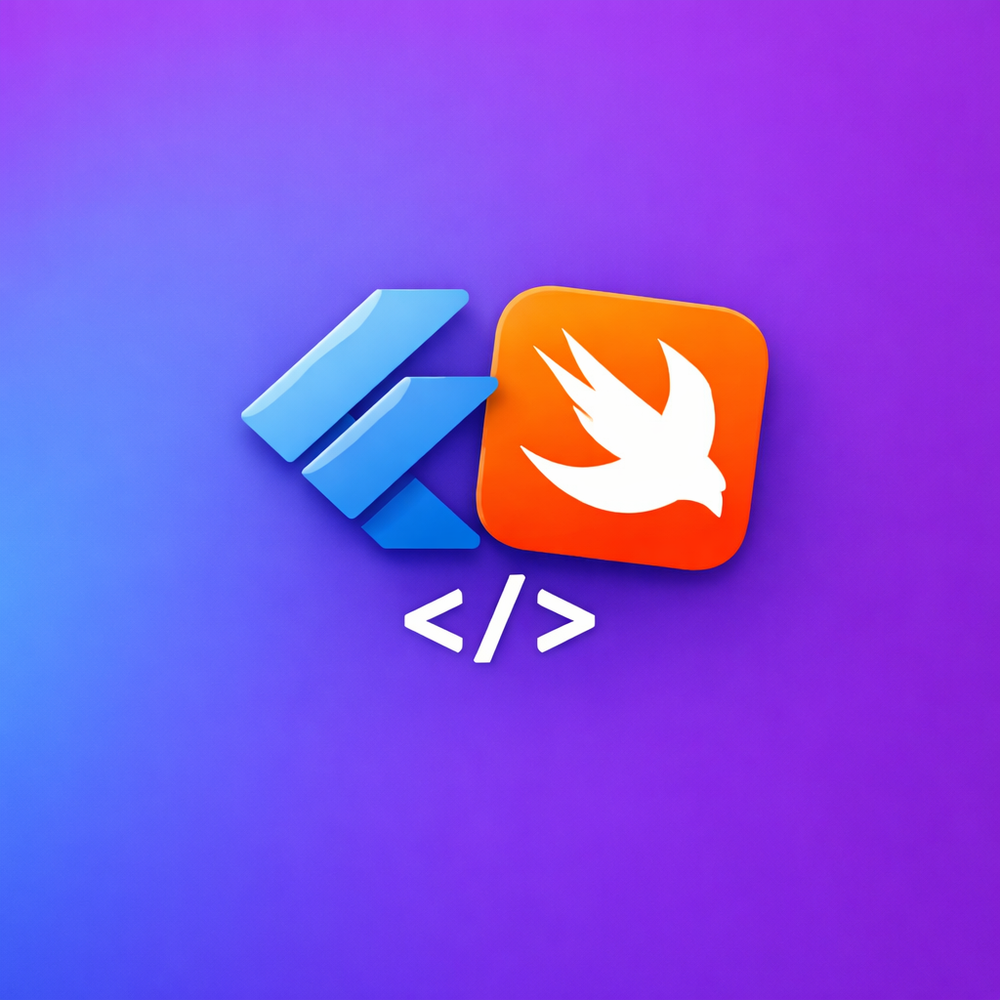
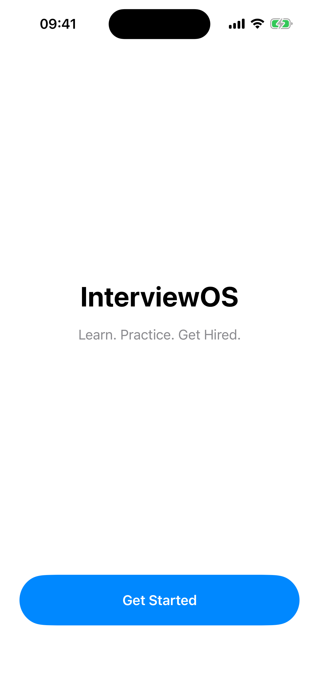
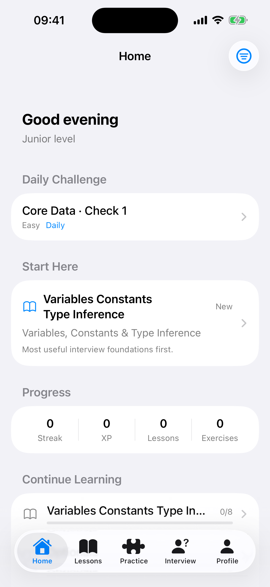
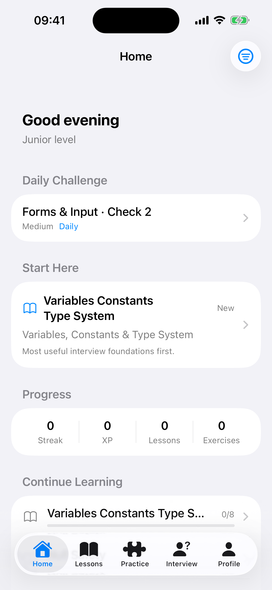

# InterviewPrep

<p align="center">
  
</p>

<p align="center">
  <strong>InterviewOS</strong> is a local-first iOS app for mobile interview preparation.
  It helps developers study <strong>Flutter</strong>, <strong>Swift/iOS</strong>, and <strong>general engineering topics</strong>
  through lessons, exercises, and interview questions in one focused workflow.
</p>

## Overview

InterviewPrep is built for the annoying moment when you open a prep app and do not know where to start.
Instead of acting like a static glossary, the app organizes content into a practical learning flow so you can
move from core interview foundations into deeper platform-specific topics.

The app currently includes:

- 104 lessons
- 809 exercises
- 366 interview questions
- 37 Flutter topics
- 44 Swift/iOS topics
- 23 general engineering topics

Everything runs locally on-device with bundled content, SwiftData persistence, and local notification reminders.
There is no account system and no backend dependency.

## Screenshots

<p align="center">
  
  
  
</p>

Screenshots above were captured on the iPhone 16 simulator.

## Features

- Three learning tracks: Flutter & Dart, Swift & iOS, and General Programming
- Interview-focused topic ordering so the app recommends where to start first
- Lessons with structured explanations, code examples, key takeaways, and mini quizzes
- Practice formats including MCQ, fill in the blank, reorder, true/false, and match pairs
- Interview question bank with conceptual, practical, behavioral, system design, and live-coding prompts
- Progress tracking with XP, streaks, completion state, and topic mastery
- Bookmarks for saving useful lessons and interview questions
- Daily reminder support using local notifications
- Fully local storage with SwiftData

## Tech Stack

- Swift 5
- SwiftUI
- SwiftData
- Bundled JSON content (`InterviewPrep/content.json`)
- Local notifications for reminder scheduling

## Project Structure

```text
InterviewPrep/
├── Models/
├── Services/
├── Theme/
├── Views/
└── content.json
```

Key areas:

- `Views/` contains onboarding, home, lessons, exercises, interview, profile, and settings screens
- `Services/ContentService.swift` loads and organizes the lesson, exercise, and interview data
- `Services/ProgressService.swift` manages completions, XP, streaks, and bookmarks
- `content.json` contains the bundled interview prep content shipped with the app

## Running Locally

1. Clone the repository:

   ```bash
   git clone https://github.com/elbeekk/InterviewPrep.git
   cd InterviewPrep
   ```

2. Open `InterviewPrep.xcodeproj` in Xcode.
3. Select the `InterviewPrep` scheme.
4. Run the app on an iPhone simulator.

## Why This Project Exists

This project is aimed at developers who want a single place to:

- learn platform concepts
- practice recall with exercises
- rehearse interview-style answers
- keep progress locally without adding account friction

## Repository

- Source: [github.com/elbeekk/InterviewPrep](https://github.com/elbeekk/InterviewPrep)
- Issues: [github.com/elbeekk/InterviewPrep/issues](https://github.com/elbeekk/InterviewPrep/issues)
